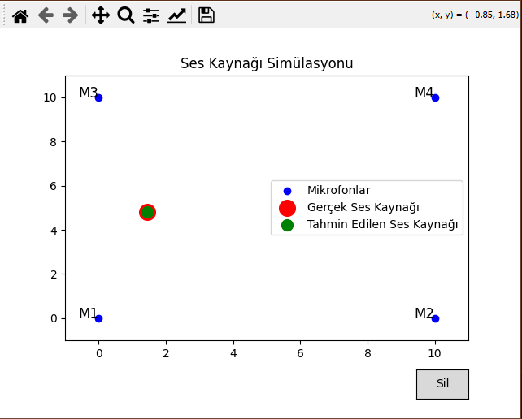
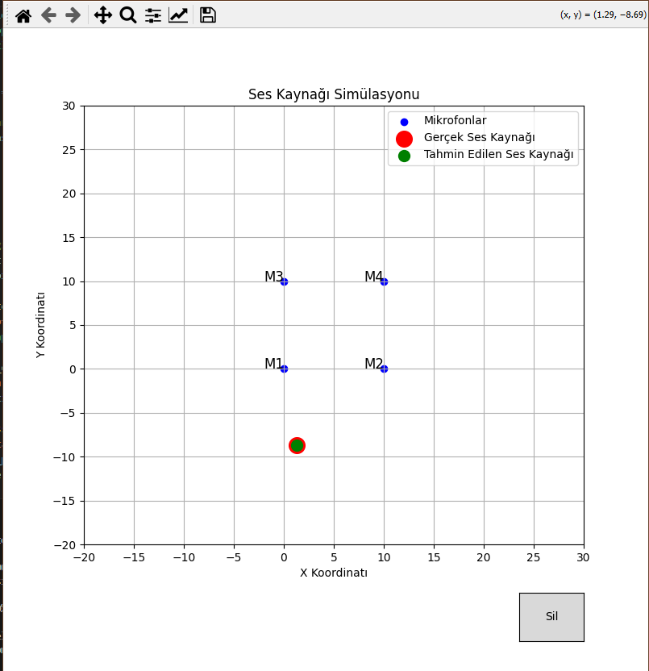
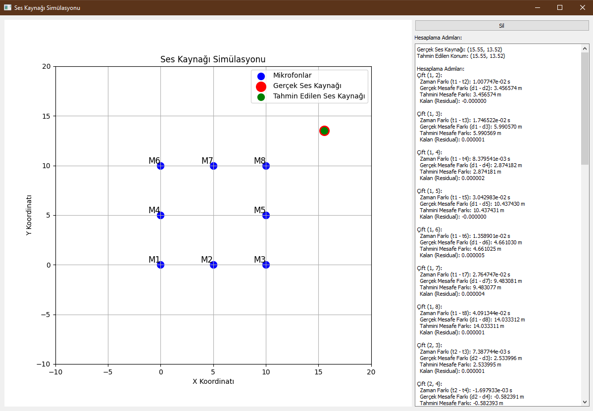
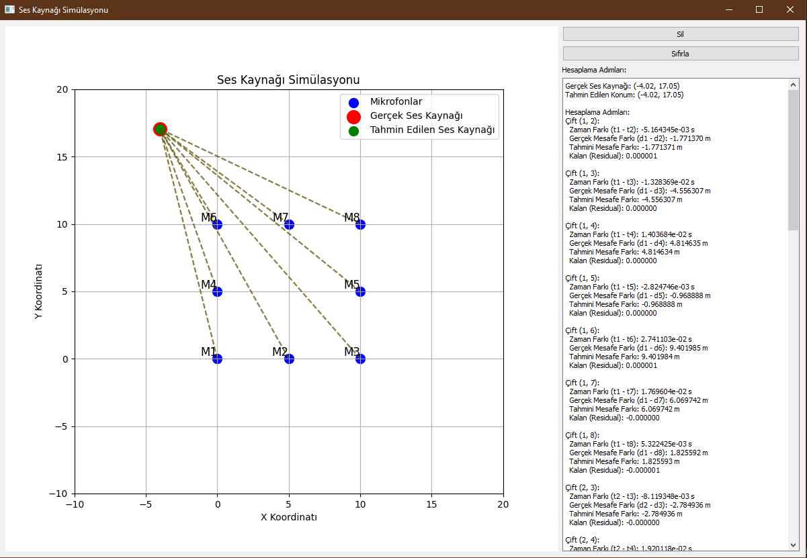
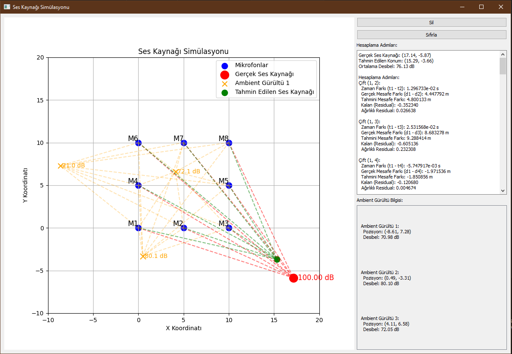
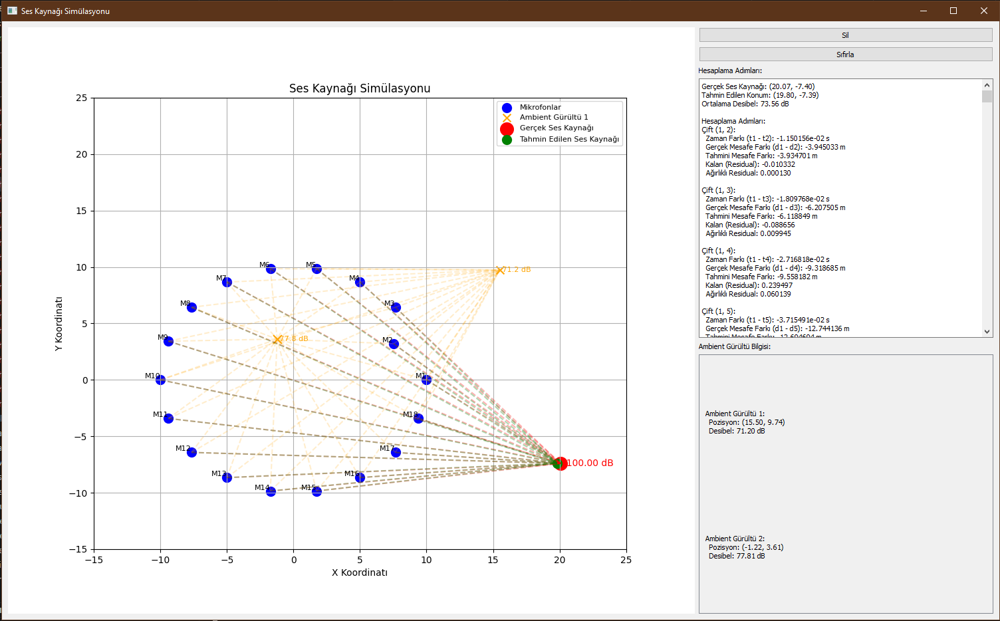
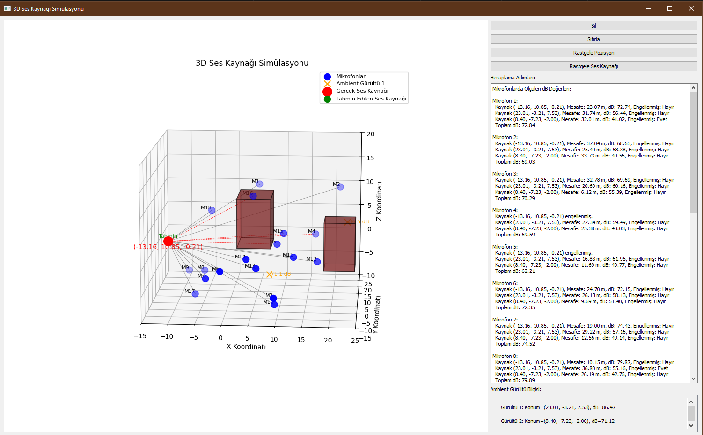
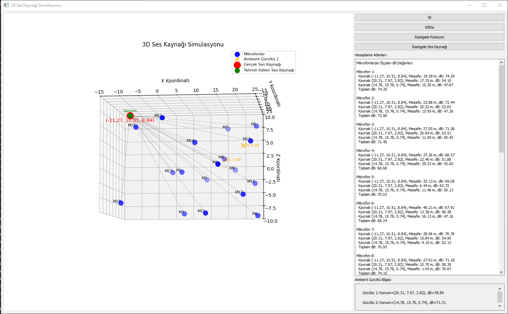
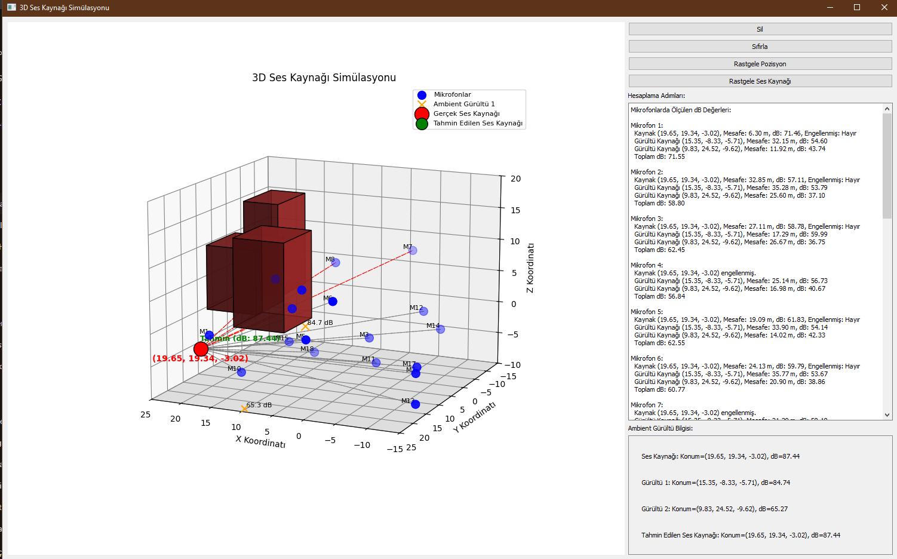

[](https://github.com/ibrahimsugun/echotrace/blob/main/README.md)
[](https://github.com/ibrahimsugun/echotrace/blob/main/README.tr.md)

# EchoTrace - 3D Sound Source Localization Simulation

## 📋 About the Project

EchoTrace is an advanced acoustic localization simulation that estimates the position and intensity of sound sources in 3D space using multiple microphone arrays. The project started as a simple 2D TDOA (Time Difference of Arrival) system and evolved into a complex 3D hybrid system over time.

## 🎯 Key Features

### Localization Capabilities
- **3D Space Position Detection**: Sound source detection in x, y, z coordinates with 18 microphones
- **Multiple Source Detection**: Simultaneous detection of main sound source + ambient noise sources
- **Decibel Estimation**: Estimating both position and dB value of sound sources
- **Obstacle Detection**: Detecting and compensating for obstacles like buildings blocking sound paths

### Technical Features
- **Hybrid Approach**: Combination of TDOA and decibel-based methods
- **Advanced Optimization**: Multi-variable optimization with SLSQP algorithm
- **Realistic Physics Model**: Physical modeling for sound propagation and attenuation
- **Dynamic Environment**: Random positioning of microphones, noise sources, and buildings

## 🛠️ Technologies Used

- **Python 3.x**
- **PyQt5**: GUI and user interaction
- **NumPy**: Mathematical calculations
- **SciPy**: Optimization algorithms
- **Matplotlib**: 3D visualization
- **mpl_toolkits.mplot3d**: 3D graphics support

## 📐 Mathematical Model

### Distance Calculation
```
d = √[(x₂-x₁)² + (y₂-y₁)² + (z₂-z₁)²]
```

### Sound Intensity Attenuation
```
dB = source_dB - 20 × log₁₀(distance)
```

### Power Summation
```
Total_Power = Σ(10^(dB/10))
Total_dB = 10 × log₁₀(Total_Power)
```

## 🚀 Installation and Running

### Requirements
```bash
pip install PyQt5
pip install numpy
pip install scipy
pip install matplotlib
```

### Running
```bash
python echoTrace_v0.4.5.py
```

## 📸 Screenshots

### Project Evolution

#### Early Versions (v0.1.x - 2D TDOA)
<div style="display: flex; flex-wrap: wrap; gap: 10px;">
  
  
</div>

*Early versions: 2D plane TDOA-based localization with 4 microphones*

#### Transition Period (v0.2.x - v0.3.x)
<div style="display: flex; flex-wrap: wrap; gap: 10px;">
  
  
  
  
</div>

*Increased microphone count, added PyQt5 interface, calculation details display*

#### 3D Transition (v0.3.3 - v0.3.8)
<div style="display: flex; flex-wrap: wrap; gap: 10px;">
  
  
  
  
  
</div>

*Beginning of 3D visualization, z-axis added*

#### Final Versions (v0.4.x - Full 3D System)
<div style="display: flex; flex-wrap: wrap; gap: 10px;">
  
  
  
</div>

*18 microphones, multiple noise sources, building obstacles*

#### v0.4.1.3 - Noise Sources


*Addition and visualization of ambient noise sources*

#### v0.4.1 - Advanced Features


*Random positioning and advanced calculation details*

#### v0.4.2.x - Building Obstacles
<div style="display: flex; flex-wrap: wrap; gap: 10px;">
  
  
</div>

*Addition of building obstacles and path blocking detection*

#### v0.4.4.1 - Final Version


*Fully functional 3D sound source localization system*

## 💡 User Guide

### Control Buttons
- **🗑️ Clear**: Clears current sound source and estimates
- **🔄 Reset**: Returns all positions to default values
- **🎲 Random Position**: Randomly positions microphones and noise sources
- **🔊 Random Sound Source**: Adds new sound source at random position

### Visual Indicators
- **🔵 Blue Points**: Microphones (M1-M18)
- **🔴 Red Point**: Actual sound source
- **🟢 Green Point**: Estimated sound source
- **🟠 Orange X**: Ambient noise sources
- **🟣 Purple Triangle**: Estimated noise sources
- **🟫 Brown Boxes**: Buildings (obstacles)
- **Gray Lines**: Unblocked sound paths
- **Red Lines**: Blocked sound paths

### 3D Rotation with Right Click
You can change the 3D perspective by holding right click and dragging the graph.

## 📊 Performance Metrics

- **Position Accuracy**: Typically ±2 meters error margin
- **dB Estimation**: ±3 dB precision
- **Processing Time**: <1 second (for 18 microphones)
- **Minimum Microphones**: At least 4 unblocked microphones required

## 🔬 Application Areas

- **Security Systems**: Gunshot detection and localization
- **Smart Home**: Determining location of voice commands
- **Industrial Monitoring**: Noise source detection
- **Rescue Operations**: Under-rubble sound localization
- **Acoustic Research**: Sound propagation and obstacle effect studies
- **Urban Planning**: Noise mapping

## 🔄 Version History

- **v0.1.x**: Simple 2D TDOA-based system
- **v0.2.x**: Improved UI and calculation details
- **v0.3.x**: PyQt5 transition and 8 microphone support
- **v0.4.0**: 3D visualization and 18 microphones
- **v0.4.1**: Ambient noise sources
- **v0.4.2**: Building obstacles and path blocking
- **v0.4.4**: Multiple source optimization
- **v0.4.5**: Final stable version

## 📝 License

This project is developed for personal hobbie.

## 👥 Contact

For questions about the project, you can contact via GitHub.

---

*This simulation demonstrates the fundamental principles of real-world acoustic localization systems. Hardware integration and real-time audio processing are required for actual applications.*