# EchoTrace - 3D Ses Kaynağı Lokalizasyon Simülasyonu

## 📋 Proje Hakkında

EchoTrace, çoklu mikrofon dizileri kullanarak 3 boyutlu uzayda ses kaynaklarının konumunu ve şiddetini tahmin eden gelişmiş bir akustik lokalizasyon simülasyonudur. Proje, başlangıçta basit 2D TDOA (Time Difference of Arrival) sistemi olarak başlamış, zamanla karmaşık 3D hibrit sisteme evrilmiştir.

## 🎯 Temel Özellikler

### Lokalizasyon Yetenekleri
- **3D Uzayda Konum Tespiti**: 18 mikrofon ile x, y, z koordinatlarında ses kaynağı tespiti
- **Çoklu Kaynak Tespiti**: Ana ses kaynağı + ambient gürültü kaynaklarını eş zamanlı tespit
- **Desibel Tahmini**: Ses kaynaklarının hem konumunu hem de dB değerini tahmin etme
- **Engel Algılama**: Binalar gibi engellerin ses yolunu kesmesini algılama ve kompanzasyon

### Teknik Özellikler
- **Hibrit Yaklaşım**: TDOA ve desibel tabanlı yöntemlerin kombinasyonu
- **Gelişmiş Optimizasyon**: SLSQP algoritması ile çok değişkenli optimizasyon
- **Gerçekçi Fizik Modeli**: Ses yayılımı ve zayıflaması için fiziksel modelleme
- **Dinamik Ortam**: Rastgele mikrofon, gürültü kaynağı ve bina konumlandırma

## 🛠️ Kullanılan Teknolojiler

- **Python 3.x**
- **PyQt5**: GUI ve kullanıcı etkileşimi
- **NumPy**: Matematiksel hesaplamalar
- **SciPy**: Optimizasyon algoritmaları
- **Matplotlib**: 3D görselleştirme
- **mpl_toolkits.mplot3d**: 3D grafik desteği

## 📐 Matematiksel Model

### Mesafe Hesaplama
```
d = √[(x₂-x₁)² + (y₂-y₁)² + (z₂-z₁)²]
```

### Ses Şiddeti Azalması
```
dB = kaynak_dB - 20 × log₁₀(mesafe)
```

### Güç Toplama
```
Toplam_Güç = Σ(10^(dB/10))
Toplam_dB = 10 × log₁₀(Toplam_Güç)
```

## 🚀 Kurulum ve Çalıştırma

### Gereksinimler
```bash
pip install PyQt5
pip install numpy
pip install scipy
pip install matplotlib
```

### Çalıştırma
```bash
python echoTrace_v0.4.5.py
```

## 📸 Ekran Görüntüleri

### Proje Evrimi

#### İlk Versiyonlar (v0.1.x - 2D TDOA)
<div style="display: flex; flex-wrap: wrap; gap: 10px;">
  
  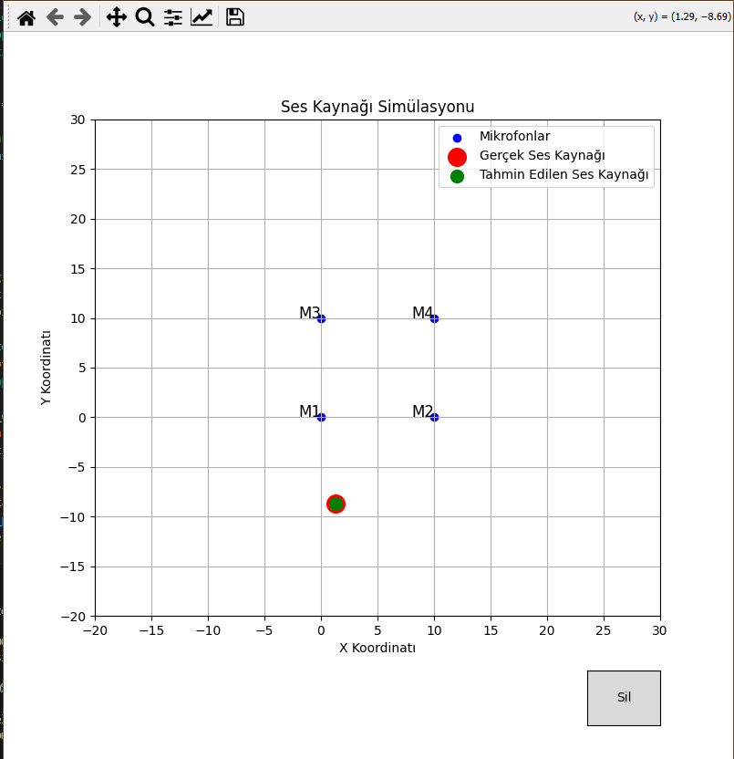
</div>

*İlk versiyonlar: 4 mikrofon ile 2D düzlemde TDOA tabanlı lokalizasyon*

#### Geçiş Dönemi (v0.2.x - v0.3.x)
<div style="display: flex; flex-wrap: wrap; gap: 10px;">
  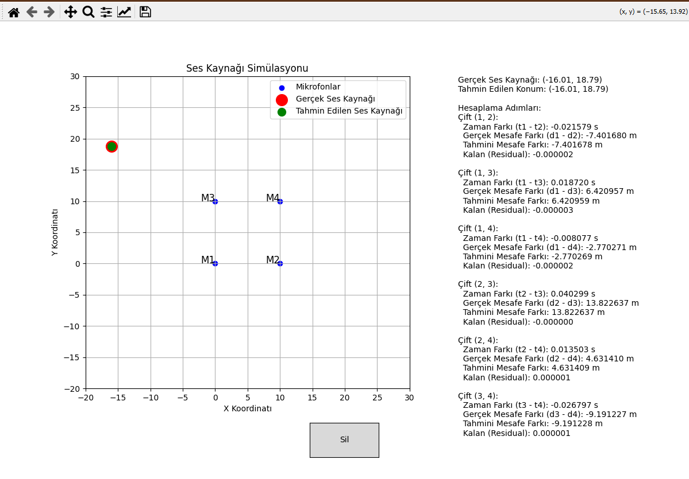
  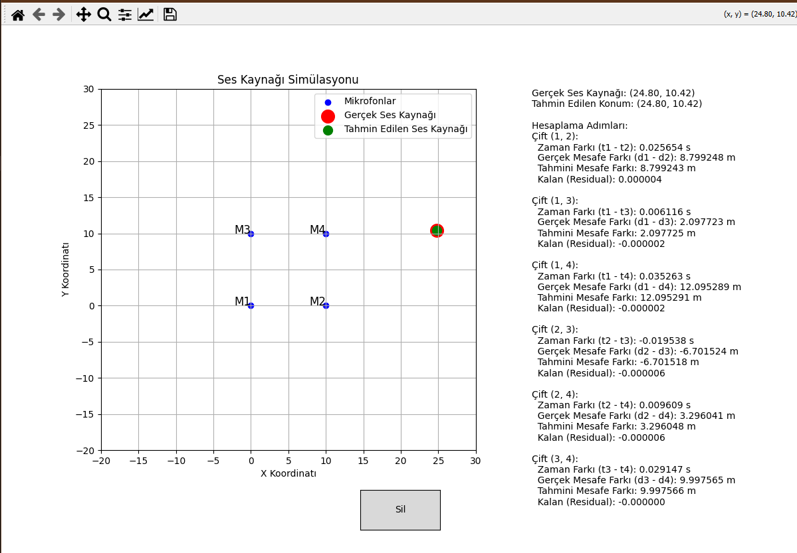
  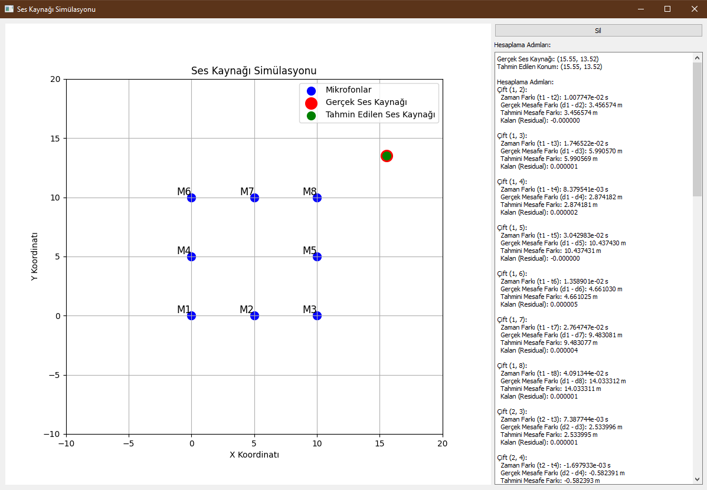
  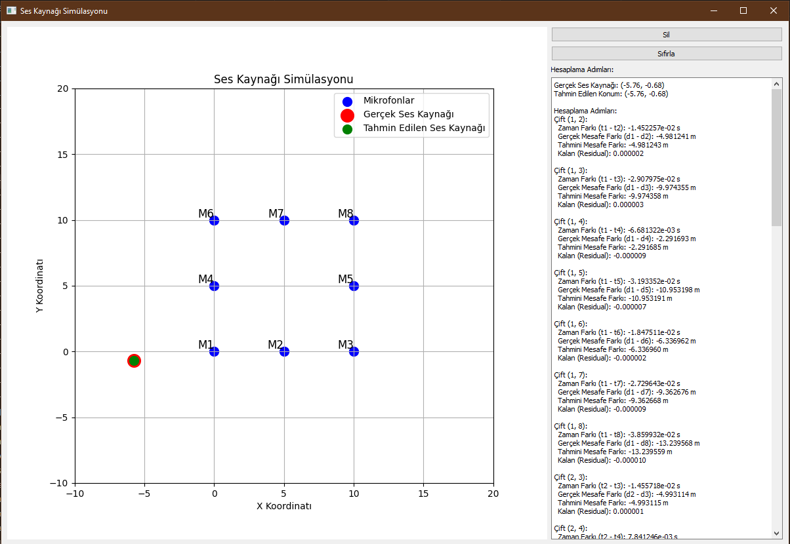
</div>

*Mikrofon sayısı artırıldı, PyQt5 arayüzü eklendi, hesaplama detayları gösterimi*

#### 3D Geçiş (v0.3.3 - v0.3.8)
<div style="display: flex; flex-wrap: wrap; gap: 10px;">
  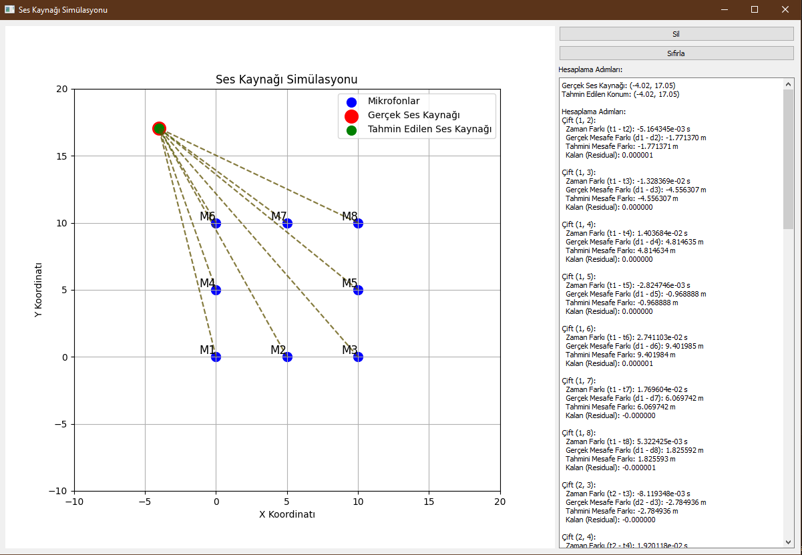
  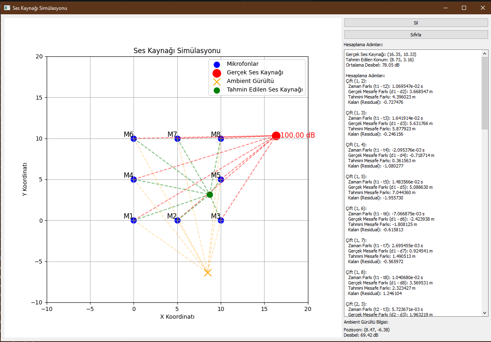
  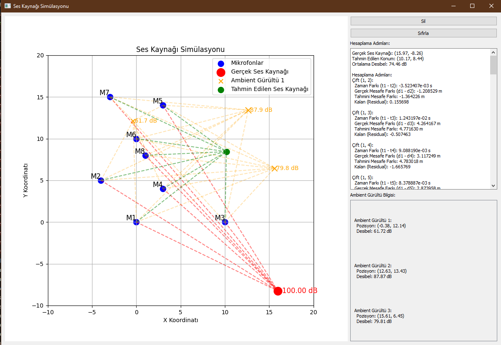
  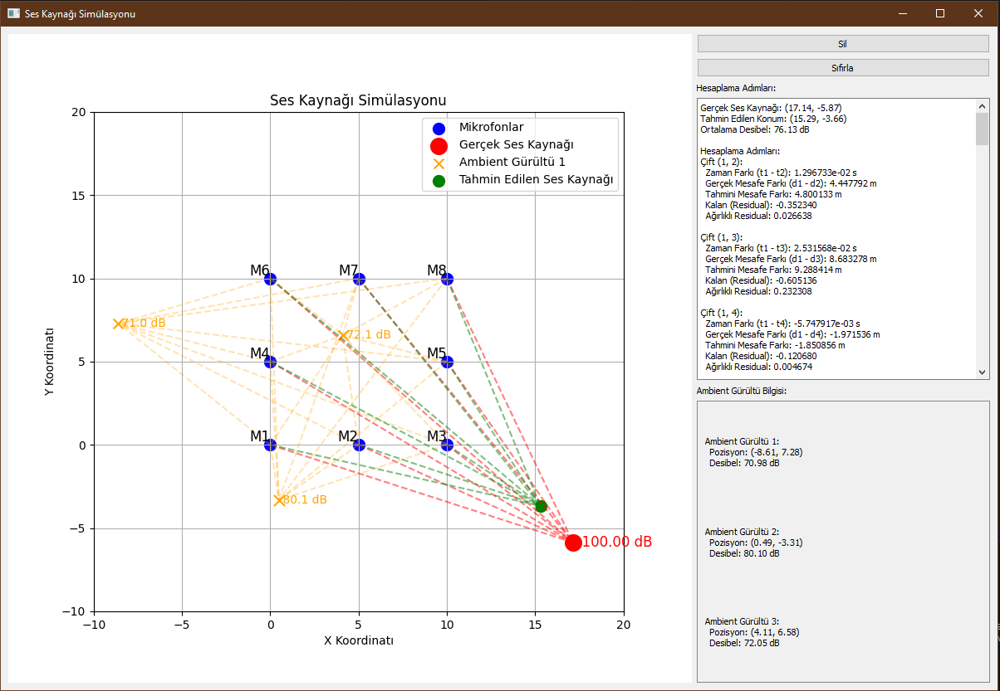
  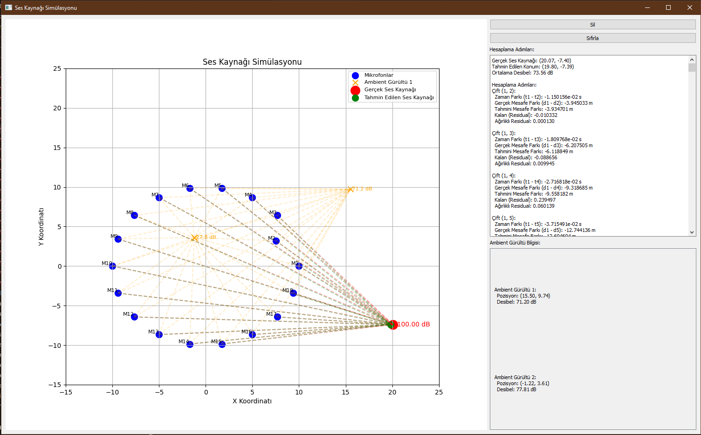
</div>

*3D görselleştirme başlangıcı, z ekseni eklendi*

#### Son Versiyonlar (v0.4.x - Tam 3D Sistem)
<div style="display: flex; flex-wrap: wrap; gap: 10px;">
  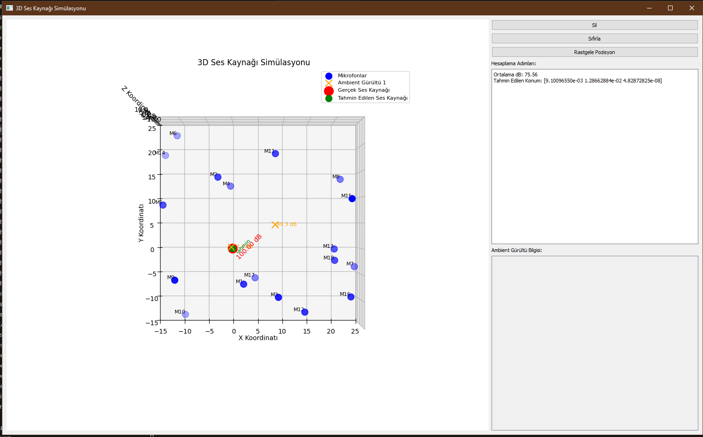
  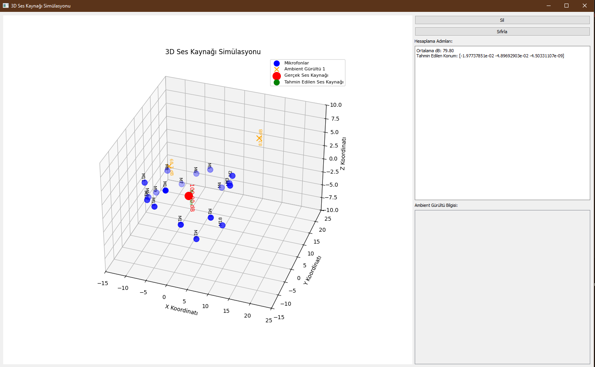
  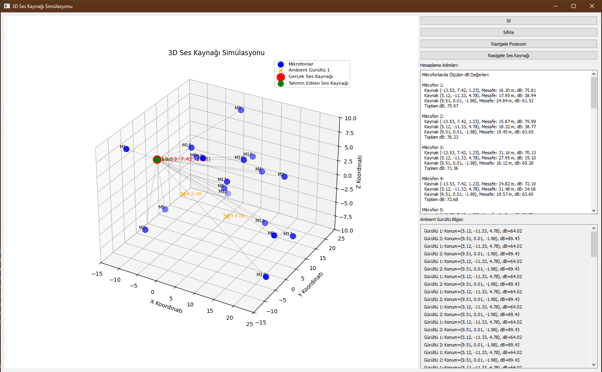
</div>

*18 mikrofon, çoklu gürültü kaynakları, bina engelleri*

#### v0.4.1.3 - Gürültü Kaynakları
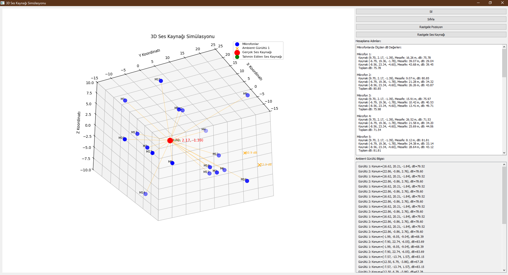


*Ambient gürültü kaynaklarının eklenmesi ve görselleştirilmesi*

#### v0.4.1 - Gelişmiş Özellikler


*Rastgele konumlandırma ve gelişmiş hesaplama detayları*

#### v0.4.2.x - Bina Engelleri
<div style="display: flex; flex-wrap: wrap; gap: 10px;">
  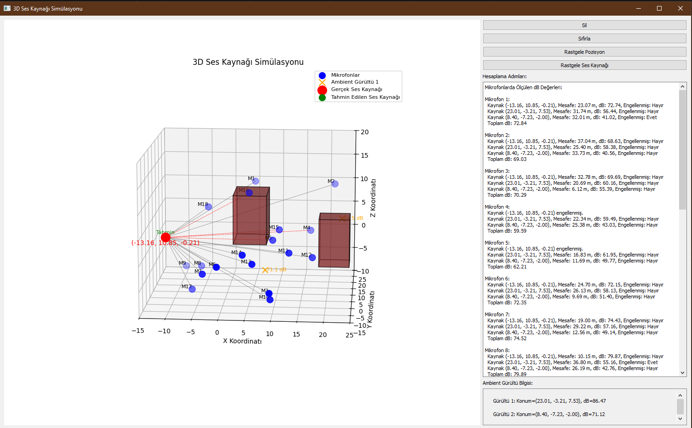
  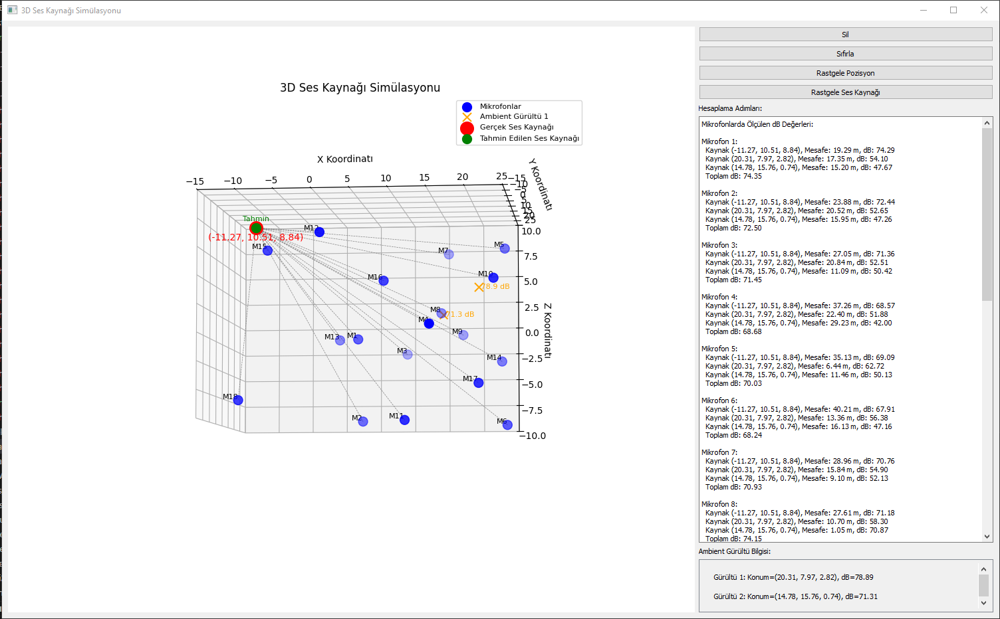
</div>

*Bina engellerinin eklenmesi ve yol kesme algılama*

#### v0.4.4.1 - Final Versiyon


*Tam fonksiyonel 3D ses kaynağı lokalizasyon sistemi*

## 💡 Kullanım Kılavuzu

### Kontrol Butonları
- **🗑️ Sil**: Mevcut ses kaynağını ve tahminleri temizler
- **🔄 Sıfırla**: Tüm konumları varsayılan değerlere döndürür
- **🎲 Rastgele Pozisyon**: Mikrofon ve gürültü kaynaklarını rastgele konumlandırır
- **🔊 Rastgele Ses Kaynağı**: Rastgele konumda yeni ses kaynağı ekler

### Görsel İşaretler
- **🔵 Mavi Noktalar**: Mikrofonlar (M1-M18)
- **🔴 Kırmızı Nokta**: Gerçek ses kaynağı
- **🟢 Yeşil Nokta**: Tahmin edilen ses kaynağı
- **🟠 Turuncu X**: Ambient gürültü kaynakları
- **🟣 Mor Üçgen**: Tahmin edilen gürültü kaynakları
- **🟫 Kahverengi Kutular**: Binalar (engeller)
- **Gri Çizgiler**: Engellenmemiş ses yolları
- **Kırmızı Çizgiler**: Engellenmiş ses yolları

### Sağ Tık ile 3D Döndürme
Grafiği sağ tık ile tutup sürükleyerek 3D perspektifi değiştirebilirsiniz.

## 📊 Performans Metrikleri

- **Konum Doğruluğu**: Tipik olarak ±2 metre hata payı
- **dB Tahmini**: ±3 dB hassasiyet
- **İşlem Süresi**: <1 saniye (18 mikrofon için)
- **Minimum Mikrofon**: En az 4 engellenmemiş mikrofon gerekli

## 🔬 Uygulama Alanları

- **Güvenlik Sistemleri**: Silah sesi tespiti ve konumlandırma
- **Akıllı Ev**: Ses komutlarının yerini belirleme
- **Endüstriyel İzleme**: Gürültü kaynağı tespiti
- **Kurtarma Operasyonları**: Enkaz altı ses lokalizasyonu
- **Akustik Araştırmalar**: Ses yayılımı ve engel etkisi çalışmaları
- **Şehir Planlama**: Gürültü haritalaması

## 🔄 Versiyon Geçmişi

- **v0.1.x**: 2D TDOA tabanlı basit sistem
- **v0.2.x**: Gelişmiş UI ve hesaplama detayları
- **v0.3.x**: PyQt5 geçişi ve 8 mikrofon desteği
- **v0.4.0**: 3D görselleştirme ve 18 mikrofon
- **v0.4.1**: Ambient gürültü kaynakları
- **v0.4.2**: Bina engelleri ve yol kesme
- **v0.4.4**: Çoklu kaynak optimizasyonu
- **v0.4.5**: Final kararlı versiyon

## 📝 Lisans

Bu proje hobi amaçlı geliştirilmiştir.

## 👥 İletişim

Proje hakkında sorularınız için GitHub üzerinden iletişime geçebilirsiniz.

---

*Bu simülasyon, gerçek dünya akustik lokalizasyon sistemlerinin temel prensiplerini göstermektedir. Gerçek uygulamalar için donanım entegrasyonu ve gerçek zamanlı ses işleme gereklidir.*